AI 기술 중 이미지 인식 기술은 우리 일상에 많은 편리함을 제공해주고 있다.   
건물 주차장 입구에서 반드시 마주치는 자동차번호 인식기는 이러한 이미지 인식 기술 중 가장 상업적 성공을 거둔 AI 기술이다.   
우리는 아래 MNIST 예제를 통해 AI의 이미지 학습과정을 살펴볼 것이고 그 결과에 감동할 것이다.


앤드류 응 교수가 배포한 손글씨 이미지   
훈련데이터 6만개, 테스트데이터 1만개


```python
]from google.colab import drive
drive.mount('/content/drive')
```

    Mounted at /content/drive
    


```python
from PIL import Image
# !pip install matplotlib
import matplotlib.pyplot as plt
%matplotlib inline
```


```python
#!pip install tensorflow
#!pip install keras

import tensorflow as tf
import keras
```


```python
# !pip install numpy
import numpy as np
```

keras 데이터 셋 중에 mnist 데이터 셋을 가져와 봅시다.


```python
from keras.datasets import mnist
(train_images, train_labels), (test_images, test_labels) = mnist.load_data()
```

    Downloading data from https://storage.googleapis.com/tensorflow/tf-keras-datasets/mnist.npz
    11493376/11490434 [==============================] - 0s 0us/step
    11501568/11490434 [==============================] - 0s 0us/step
    


```python
train_images.shape
```


    (60000, 28, 28)


```python
test_images.shape
```


    (10000, 28, 28)


```python
train_labels
```


    array([5, 0, 4, ..., 5, 6, 8], dtype=uint8)


```python
test_labels
```


    array([7, 2, 1, ..., 4, 5, 6], dtype=uint8)


```python
from IPython.display import Image
Image('/content/drive/MyDrive/융합소프트웨어프로그래밍/손글씨 MNIST 자료/label.jpg')
```


    
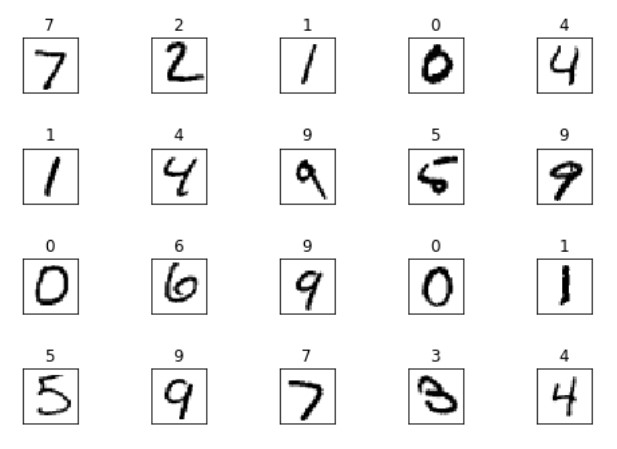
    


```python
train_images[0]
```


    array([[  0,   0,   0,   0,   0,   0,   0,   0,   0,   0,   0,   0,   0,
              0,   0,   0,   0,   0,   0,   0,   0,   0,   0,   0,   0,   0,
              0,   0],
           [  0,   0,   0,   0,   0,   0,   0,   0,   0,   0,   0,   0,   0,
              0,   0,   0,   0,   0,   0,   0,   0,   0,   0,   0,   0,   0,
              0,   0],
           [  0,   0,   0,   0,   0,   0,   0,   0,   0,   0,   0,   0,   0,
              0,   0,   0,   0,   0,   0,   0,   0,   0,   0,   0,   0,   0,
              0,   0],
           [  0,   0,   0,   0,   0,   0,   0,   0,   0,   0,   0,   0,   0,
              0,   0,   0,   0,   0,   0,   0,   0,   0,   0,   0,   0,   0,
              0,   0],
           [  0,   0,   0,   0,   0,   0,   0,   0,   0,   0,   0,   0,   0,
              0,   0,   0,   0,   0,   0,   0,   0,   0,   0,   0,   0,   0,
              0,   0],
           [  0,   0,   0,   0,   0,   0,   0,   0,   0,   0,   0,   0,   3,
             18,  18,  18, 126, 136, 175,  26, 166, 255, 247, 127,   0,   0,
              0,   0],
           [  0,   0,   0,   0,   0,   0,   0,   0,  30,  36,  94, 154, 170,
            253, 253, 253, 253, 253, 225, 172, 253, 242, 195,  64,   0,   0,
              0,   0],
           [  0,   0,   0,   0,   0,   0,   0,  49, 238, 253, 253, 253, 253,
            253, 253, 253, 253, 251,  93,  82,  82,  56,  39,   0,   0,   0,
              0,   0],
           [  0,   0,   0,   0,   0,   0,   0,  18, 219, 253, 253, 253, 253,
            253, 198, 182, 247, 241,   0,   0,   0,   0,   0,   0,   0,   0,
              0,   0],
           [  0,   0,   0,   0,   0,   0,   0,   0,  80, 156, 107, 253, 253,
            205,  11,   0,  43, 154,   0,   0,   0,   0,   0,   0,   0,   0,
              0,   0],
           [  0,   0,   0,   0,   0,   0,   0,   0,   0,  14,   1, 154, 253,
             90,   0,   0,   0,   0,   0,   0,   0,   0,   0,   0,   0,   0,
              0,   0],
           [  0,   0,   0,   0,   0,   0,   0,   0,   0,   0,   0, 139, 253,
            190,   2,   0,   0,   0,   0,   0,   0,   0,   0,   0,   0,   0,
              0,   0],
           [  0,   0,   0,   0,   0,   0,   0,   0,   0,   0,   0,  11, 190,
            253,  70,   0,   0,   0,   0,   0,   0,   0,   0,   0,   0,   0,
              0,   0],
           [  0,   0,   0,   0,   0,   0,   0,   0,   0,   0,   0,   0,  35,
            241, 225, 160, 108,   1,   0,   0,   0,   0,   0,   0,   0,   0,
              0,   0],
           [  0,   0,   0,   0,   0,   0,   0,   0,   0,   0,   0,   0,   0,
             81, 240, 253, 253, 119,  25,   0,   0,   0,   0,   0,   0,   0,
              0,   0],
           [  0,   0,   0,   0,   0,   0,   0,   0,   0,   0,   0,   0,   0,
              0,  45, 186, 253, 253, 150,  27,   0,   0,   0,   0,   0,   0,
              0,   0],
           [  0,   0,   0,   0,   0,   0,   0,   0,   0,   0,   0,   0,   0,
              0,   0,  16,  93, 252, 253, 187,   0,   0,   0,   0,   0,   0,
              0,   0],
           [  0,   0,   0,   0,   0,   0,   0,   0,   0,   0,   0,   0,   0,
              0,   0,   0,   0, 249, 253, 249,  64,   0,   0,   0,   0,   0,
              0,   0],
           [  0,   0,   0,   0,   0,   0,   0,   0,   0,   0,   0,   0,   0,
              0,  46, 130, 183, 253, 253, 207,   2,   0,   0,   0,   0,   0,
              0,   0],
           [  0,   0,   0,   0,   0,   0,   0,   0,   0,   0,   0,   0,  39,
            148, 229, 253, 253, 253, 250, 182,   0,   0,   0,   0,   0,   0,
              0,   0],
           [  0,   0,   0,   0,   0,   0,   0,   0,   0,   0,  24, 114, 221,
            253, 253, 253, 253, 201,  78,   0,   0,   0,   0,   0,   0,   0,
              0,   0],
           [  0,   0,   0,   0,   0,   0,   0,   0,  23,  66, 213, 253, 253,
            253, 253, 198,  81,   2,   0,   0,   0,   0,   0,   0,   0,   0,
              0,   0],
           [  0,   0,   0,   0,   0,   0,  18, 171, 219, 253, 253, 253, 253,
            195,  80,   9,   0,   0,   0,   0,   0,   0,   0,   0,   0,   0,
              0,   0],
           [  0,   0,   0,   0,  55, 172, 226, 253, 253, 253, 253, 244, 133,
             11,   0,   0,   0,   0,   0,   0,   0,   0,   0,   0,   0,   0,
              0,   0],
           [  0,   0,   0,   0, 136, 253, 253, 253, 212, 135, 132,  16,   0,
              0,   0,   0,   0,   0,   0,   0,   0,   0,   0,   0,   0,   0,
              0,   0],
           [  0,   0,   0,   0,   0,   0,   0,   0,   0,   0,   0,   0,   0,
              0,   0,   0,   0,   0,   0,   0,   0,   0,   0,   0,   0,   0,
              0,   0],
           [  0,   0,   0,   0,   0,   0,   0,   0,   0,   0,   0,   0,   0,
              0,   0,   0,   0,   0,   0,   0,   0,   0,   0,   0,   0,   0,
              0,   0],
           [  0,   0,   0,   0,   0,   0,   0,   0,   0,   0,   0,   0,   0,
              0,   0,   0,   0,   0,   0,   0,   0,   0,   0,   0,   0,   0,
              0,   0]], dtype=uint8)


```python
for i in range(5):
  digit = train_images[i]
  plt.imshow(digit, cmap=plt.cm.binary)
  plt.show()
```


    
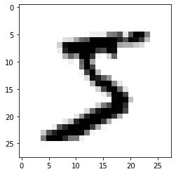
    


    
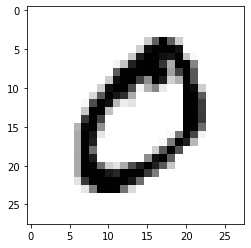
    


    
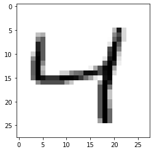
    


    
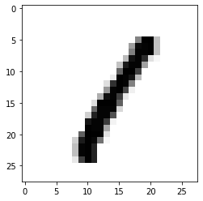
    


    
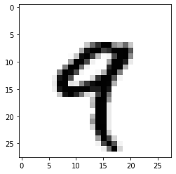
    


```python
digit = train_images[-1]
plt.imshow(digit, cmap=plt.cm.binary)
plt.show()
```


    
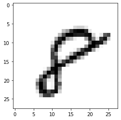
    


```python
# train 데이터 모습
import matplotlib.pyplot as plt

row = 10
col = 10
n = row * col
plt.figure(figsize=(5, 5))
for i in range(n):
  ax = plt.subplot(row, col, i+1)
  plt.imshow(train_images[i].reshape(28,28))
  plt.gray()
  ax.get_xaxis().set_visible(False)
  ax.get_yaxis().set_visible(False)
plt.show()  
```


    
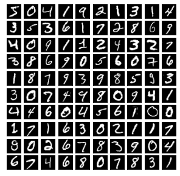
    


```python
# test 데이터 모습

row = 10
col = 10
n = row * col
plt.figure(figsize=(5, 5))
for i in range(n):
  ax = plt.subplot(row, col, i+1)
  plt.imshow(test_images[i].reshape(28,28))
  plt.gray()
  ax.get_xaxis().set_visible(False)
  ax.get_yaxis().set_visible(False)
plt.show()  
```


    
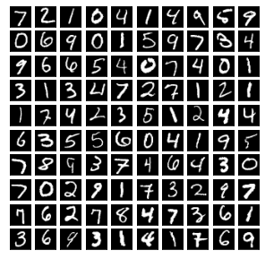
    


이제부터는 인공신경망 모델을 만들어 봅시다.


```python
from IPython.display import Image
Image('/content/drive/MyDrive/융합소프트웨어프로그래밍/손글씨 MNIST 자료/ann.png')
```


    
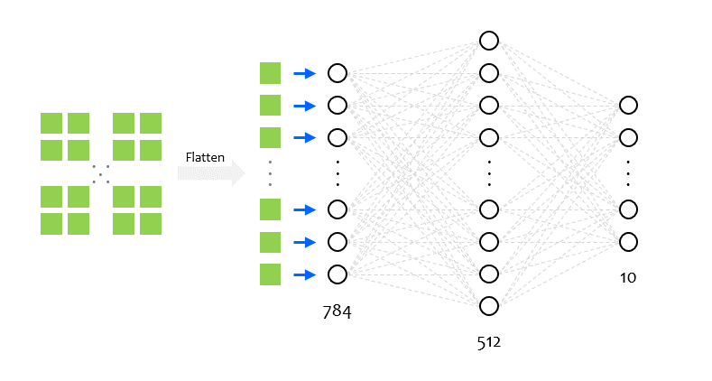
    


```python
from keras import models
from keras import layers
```


```python
model = models.Sequential()
model.add(layers.Dense(512, activation='relu', input_shape=(28*28, )))  #784
model.add(layers.Dense(256, activation='relu'))
model.add(layers.Dense(128, activation='relu'))
model.add(layers.Dense(64, activation='relu'))
model.add(layers.Dense(10, activation='softmax'))
```

윗 부분은 수정 가능하다. 예를 들어 숫자 바꿔도 됨


```python
model.summary()
```

    Model: "sequential"
    _________________________________________________________________
    Layer (type)                 Output Shape              Param #   
    =================================================================
    dense (Dense)                (None, 512)               401920    
    _________________________________________________________________
    dense_1 (Dense)              (None, 256)               131328    
    _________________________________________________________________
    dense_2 (Dense)              (None, 128)               32896     
    _________________________________________________________________
    dense_3 (Dense)              (None, 64)                8256      
    _________________________________________________________________
    dense_4 (Dense)              (None, 10)                650       
    =================================================================
    Total params: 575,050
    Trainable params: 575,050
    Non-trainable params: 0
    _________________________________________________________________
    


```python
from IPython.display import Image
Image('/content/drive/MyDrive/융합소프트웨어프로그래밍/손글씨 MNIST 자료/ReLU.jpg')
```


    
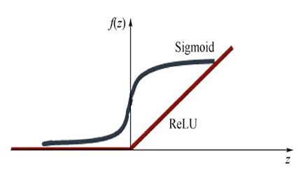
    


```python
model.compile(optimizer = 'rmsprop', 
              loss = 'categorical_crossentropy', 
              metrics = ['accuracy'])
```

아래는 데이터 전처리 작업입니다.   
숫자의 크기를 작게 하기 위해 255로 나눠 0~1 사이의 값으로 변환합니다.


```python
train_images = train_images.reshape((60000, 28*28))
train_images = train_images.astype('float32')/255
#train_images[0]
train_images.shape
```


    (60000, 784)


```python
test_images = test_images.reshape((10000, 28*28))
test_images = test_images.astype('float32')/255
test_images.shape
```


    (10000, 784)


```python
from tensorflow.keras.utils import to_categorical
```


```python
# 아래에는 훈련데이터의 정답들이 들어있다.
train_labels
```


    array([5, 0, 4, ..., 5, 6, 8], dtype=uint8)


```python
from IPython.display import Image
Image('/content/drive/MyDrive/융합소프트웨어프로그래밍/손글씨 MNIST 자료/mnist_onehot.png')
```


    
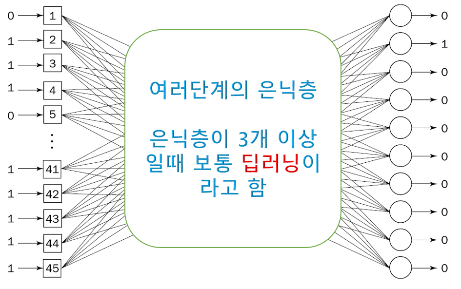
    


```python
# one-hot 인코딩
train_labels = to_categorical(train_labels)
train_labels
```


    array([[0., 0., 0., ..., 0., 0., 0.],
           [1., 0., 0., ..., 0., 0., 0.],
           [0., 0., 0., ..., 0., 0., 0.],
           ...,
           [0., 0., 0., ..., 0., 0., 0.],
           [0., 0., 0., ..., 0., 0., 0.],
           [0., 0., 0., ..., 0., 1., 0.]], dtype=float32)


```python
# 아래는 one-hot 인코딩의 예이다.

str = [2,1,3,4,5,6,1,7,8,9,0]

import tensorflow as tf
from tensorflow.keras.preprocessing.text import Tokenizer

onehot = tf.keras.utils.to_categorical(str)
print("  0, 1, 2, 3, 4, 5, 6, 7, 8, 9")
print(onehot)
```

      0, 1, 2, 3, 4, 5, 6, 7, 8, 9
    [[0. 0. 1. 0. 0. 0. 0. 0. 0. 0.]
     [0. 1. 0. 0. 0. 0. 0. 0. 0. 0.]
     [0. 0. 0. 1. 0. 0. 0. 0. 0. 0.]
     [0. 0. 0. 0. 1. 0. 0. 0. 0. 0.]
     [0. 0. 0. 0. 0. 1. 0. 0. 0. 0.]
     [0. 0. 0. 0. 0. 0. 1. 0. 0. 0.]
     [0. 1. 0. 0. 0. 0. 0. 0. 0. 0.]
     [0. 0. 0. 0. 0. 0. 0. 1. 0. 0.]
     [0. 0. 0. 0. 0. 0. 0. 0. 1. 0.]
     [0. 0. 0. 0. 0. 0. 0. 0. 0. 1.]
     [1. 0. 0. 0. 0. 0. 0. 0. 0. 0.]]
    

(보충설명) 범주형 데이터를 취급할 때 원핫인코딩(One Hot Encoding)을 해준다.

데이터에는 수치형 데이터와 텍스트 데이터나 범주형 데이터가 있다.   
머신러닝이나 딥러닝 알고리즘은 수치로 된 데이터만 이해할 수 있다.   
그래서 기계가 이해할 수 있는 형태로 데이터를 변환해 주어야 하는데 범주형 데이터는 원핫인코딩 형태로 변환해 준다.   
원핫인코딩이란 해당되는 하나의 데이터만 1로 변경해 주고 나머지는 0으로 채워주는 것을 뜻한다.   

아래에 과일이라는 컬럼에 사과, 배, 감이 들어있다.
이 때 사과, 배, 감으로 컬럼을 만들고 해당 되는 과일에만 1로 표기 해주고 나머지 과일은 0으로 표기해 준다.


```python
from IPython.display import Image
Image('/content/drive/MyDrive/융합소프트웨어프로그래밍/손글씨 MNIST 자료/onehot.png')
```


    
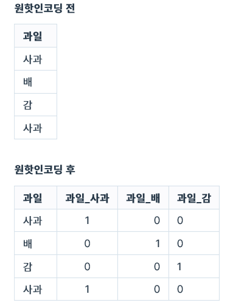
    


```python
# 테스트 데이터의 레이블도 one-hot 인코딩
test_labels = to_categorical(test_labels)
```

이제 학습을 시켜봅시다.


```python
model.fit(train_images, train_labels, epochs=5, batch_size=64)
```

    Epoch 1/5
    938/938 [==============================] - 8s 5ms/step - loss: 0.2347 - accuracy: 0.9279
    Epoch 2/5
    938/938 [==============================] - 5s 5ms/step - loss: 0.0990 - accuracy: 0.9714
    Epoch 3/5
    938/938 [==============================] - 5s 5ms/step - loss: 0.0733 - accuracy: 0.9798
    Epoch 4/5
    938/938 [==============================] - 5s 5ms/step - loss: 0.0572 - accuracy: 0.9841
    Epoch 5/5
    938/938 [==============================] - 4s 5ms/step - loss: 0.0513 - accuracy: 0.9865
    


    <keras.callbacks.History at 0x7f6bedafc950>


```python
test_loss, test_acc = model.evaluate(test_images, test_labels)
```

    313/313 [==============================] - 1s 3ms/step - loss: 0.0766 - accuracy: 0.9801
    

정확도가 얼마가 나왔는지 확인해 봅시다.


```python
test_acc
```


    0.9800999760627747


잘 학습을 했는지 이제 검증해 볼까요?   
보여주지 않았던 새로운 이미지를 보여줘 봅시다.

가끔 결과가 틀릴수도 있습니다. 바로 위 셀의 결과와 같이 정확도가 100이 아니였기 때문입니다.


```python
(ti, tl), (testi, testl) = mnist.load_data()
plt.imshow(testi[0], cmap=plt.cm.binary)
```


    <matplotlib.image.AxesImage at 0x7f6bea9ced50>


    
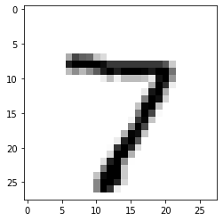
    


```python
output = model.predict(testi[0].reshape((1, 28*28)))
print('result : ', np.argmax(output))
```

    result :  7
    


```python
(ti, tl), (testi, testl) = mnist.load_data()
plt.imshow(testi[1], cmap=plt.cm.binary)
```


    <matplotlib.image.AxesImage at 0x7f6bedd79350>


    
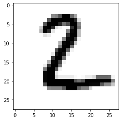
    


```python
output = model.predict(testi[1].reshape((1, 28*28)))
print('result : ', np.argmax(output))
```

    result :  2
    


```python
output
```


    array([[0., 0., 1., 0., 0., 0., 0., 0., 0., 0.]], dtype=float32)


```python
(ti, tl), (testi, testl) = mnist.load_data()
plt.imshow(testi[-1], cmap=plt.cm.binary)
```


    <matplotlib.image.AxesImage at 0x7f6bedf64f10>


    
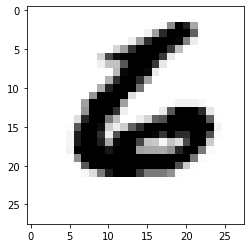
    


```python
output = model.predict(testi[-1].reshape((1, 28*28)))
print('result : ', np.argmax(output))
```

    result :  6
    


```python
output
```


    array([[0., 0., 0., 0., 0., 0., 1., 0., 0., 0.]], dtype=float32)


---
이제 우리가 직접 쓴 손글씨 이미지를 제시해 주고 잘 알아 맞추는지 보겠습니다.   
(그림판을 이용하여 검정바탕에 흰색으로 손글씨 숫자 이미지(jpg)를 제작해 주세요.)


```python
from PIL import Image
my_img = Image.open('/content/drive/MyDrive/융합소프트웨어프로그래밍/손글씨 MNIST 자료/숫자1.jpg')
my_img = my_img.resize((28,28))
my_son_img = np.array(my_img)   # 이미지를 숫자 데이터로 변환
my_son_img.shape
plt.imshow(my_son_img)
```


    <matplotlib.image.AxesImage at 0x7f6bee134cd0>


    
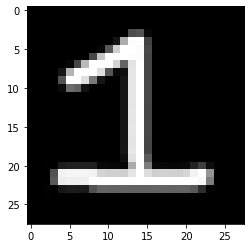
    


```python
from PIL import Image
my_img = Image.open('/content/drive/MyDrive/융합소프트웨어프로그래밍/손글씨 MNIST 자료/숫자5.jpg')
my_img = my_img.resize((28,28))
my_son_img = np.array(my_img)   # 이미지를 숫자 데이터로 변환
my_son_img.shape
plt.imshow(my_son_img)
```


    <matplotlib.image.AxesImage at 0x7f6becf4dfd0>


    
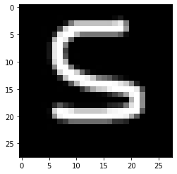
    


```python
trans_img = my_son_img.transpose(2,0,1)
#trans_img.shape
trans_test_img = trans_img[0].reshape((1, 28*28))
trans_test_img = trans_test_img.astype('float32')/255   # 0부터 1사이의 값으로 바꿈
# 내가 쓴 손 글씨도 잘 인식하는지 확인해 봅시다.
output = model.predict(trans_test_img)
print('정재현 AI는 과연 얼마로 인식했을까? : ', np.argmax(output))
```

    정재현 AI는 과연 얼마로 인식했을까? :  5
    

여기에 사용된 기본 source code는 이형석님, 
marearts님의 YouTube 강의에서 참고했습니다.   
그리고 우리의 강의안으로 사용하고자 추가적인 설명을 더 넣었습니다.    
만약, 재사용할 경우 출처를 꼭 명시해 주세요.
